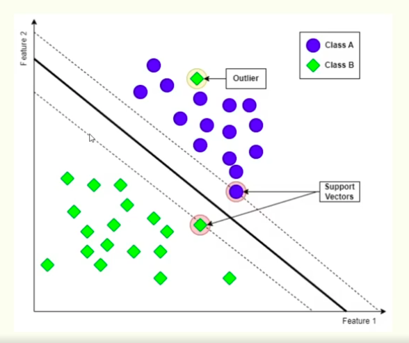
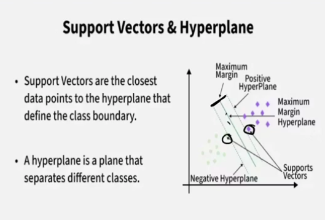
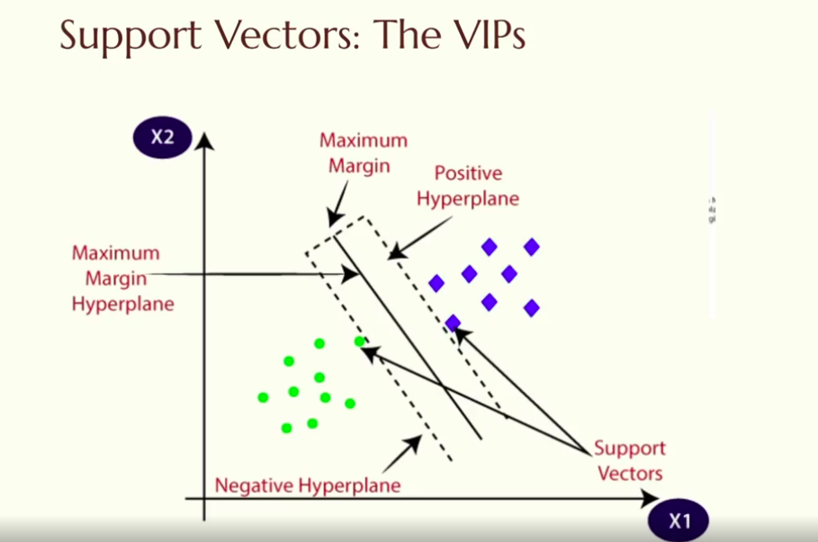

## Support Vector Machine (SVM)

- It's a classification algorithm
- Finds the optimal hyperplane that best separates the classes in the feature space
- Can be used for both linear and non-linear classification tasks
- Uses kernel functions to handle non-linear data by mapping it to a higher-dimensional space
- Common kernels include linear, polynomial, and radial basis function (RBF)
  
### Real-world applications of SVM: 
- Image classification
- Text categorization
- Bioinformatics (e.g., gene classification)
- Handwritten digit recognition 
- Financial Modeling

## Core Idea: 
- SVM finds the best possible boundary between classes by maximizing the margin 
- The margin is the distance between the hyperplane and the nearest data points from each class (called support vectors)
  

- Think of it as drawing the widest possible road between two neightborhoods --the wider the road, the clearest the separation. 

# Why Margin Matters: 
- The margin the distance from the decision boundary to the nearest data point on either side.
- **Bigger margin = better generalization**
- A wider margin means the model is confident about its classifications and less likely to misclassify new, unseen data.

# Hard vs Soft Margin:
- **Hard Margin**: No misclassifications allowed, only works if data is perfectly linearly separable.
- **Soft Margin**: Allows some misclassifications to achieve better generalization on real-world data that is often noisy and not perfectly separable.